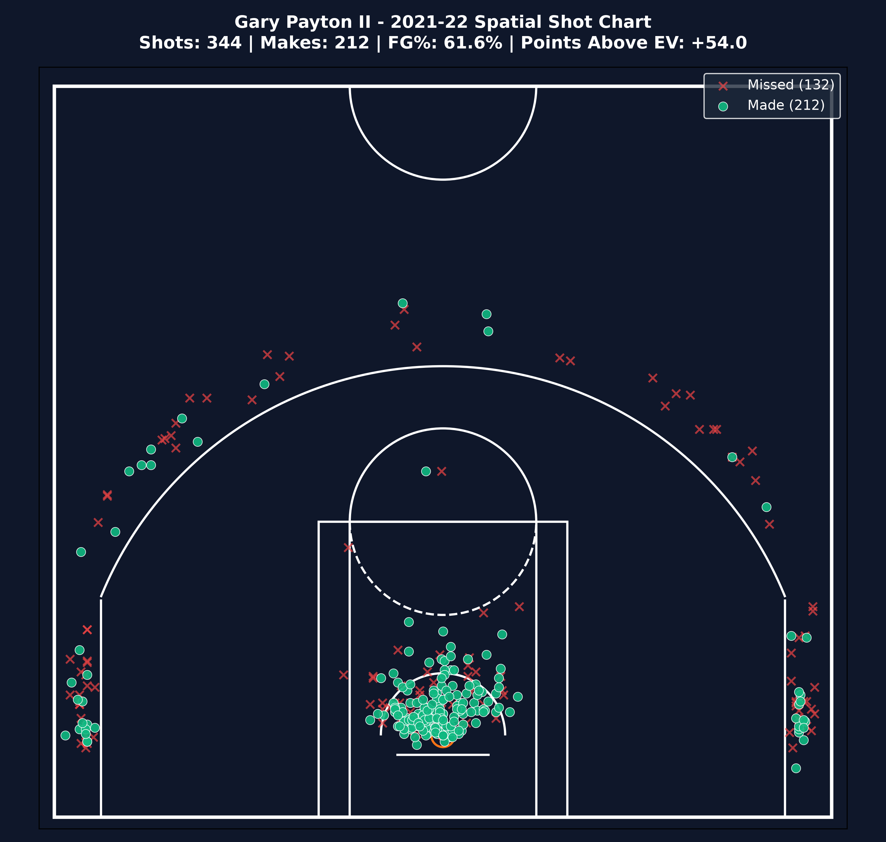

# 🏀 NBA Spatial Efficiency & Expected Value (EV) Analytics

An automated Python ETL pipeline and Power BI spatial analytics framework analyzing **7,000+ shot attempts** for the **Golden State Warriors (2021-22 NBA Championship Season)**. It transforms raw 2D court coordinates into spatial Expected Value (EV) metrics and renders interactive half-court shot charts.

---

## 🖼️ Visual Showcase

### **Stephen Curry - Spatial Shot Chart (1,224 Attempts)**


### **Klay Thompson & Gary Payton II Shot Charts**
| **Klay Thompson** | **Gary Payton II (Highest EV / Shot)** |
| :---: | :---: |
|  |  |

---

## 📊 Key Analytics & Insights

* **Stephen Curry**: 1,224 total shot attempts (535 FGM, 43.7% FG%), generating **+15.41 Points Above Expected (PAE)** driven by high 3-point volume.
* **Gary Payton II**: Highest efficiency on the championship roster with **+53.99 PAE** (**+0.1569 PAE per shot**) due to high-value rim finishing (61.6% FG%).
* **Andrew Wiggins**: Generated **+29.32 PAE** across 1,019 shot attempts with a 54.3% Effective Field Goal Percentage (eFG%).

---

## 📐 Analytical & Mathematical Framework

### **1. Coordinate Normalization (50ft x 47ft Half-Court)**
Raw NBA API coordinates (`LOC_X` in `[-250, 250]`, `LOC_Y` in `[-52, 418]`) in tenths of a foot are normalized to standard court dimensions for Power BI and Python scatter visuals:
* **`POWERBI_X`** = `(LOC_X + 250) / 10`  *(Range: 0 to 50 feet)*
* **`POWERBI_Y`** = `(LOC_Y + 52) / 10`  *(Range: 0 to 47 feet)*

### **2. Expected Value (EV) Metrics**
* **Shot Value**: `3` for 3-Point attempts, `2` for 2-Point attempts.
* **Zone Baseline FG%**: Baseline scoring percentage for each spatial court zone.
* **Expected Value (EV)** = `Shot Value * Zone Baseline FG%`
* **Points Above Expected (PAE)** = `Actual Points Scored - Expected Value`

---

## 📁 Repository Structure

```text
NBA Spatial Efficiency Analysis/
├── data/
│   ├── raw/
│   │   └── GSW_2022_Roster_Shots.csv       # Raw spatial API shot extract
│   └── processed/
│       ├── Fact_Shots.csv                  # 7,081 granular shot facts with EV metrics
│       ├── Dim_Player.csv                  # Player dimension table & aggregate stats
│       └── Dim_Shot_Zone.csv               # Spatial zone efficiency benchmarks
├── src/
│   ├── config.py                           # Central configuration & API rate limits
│   ├── ingestion.py                        # NBA REST API fetcher with retries & caching
│   ├── processing.py                       # Coordinate scaling & EV calculation
│   ├── pipeline.py                         # Automated CLI orchestrator
│   └── court_visualizer.py             # Matplotlib half-court shot chart renderer
├── powerbi/
│   ├── DAX_Measures.dax                    # Pre-written Power BI DAX metrics
│   ├── Court_Coordinate_Mapping_Guide.md   # Step-by-step Power BI setup guide
│   ├── nba_half_court.jpg              # High-res half-court background visual
│   ├── Stephen_Curry_Shot_Chart.png    # Plotted shot chart image
│   ├── Klay_Thompson_Shot_Chart.png     # Plotted shot chart image
│   └── Gary_Payton_II_Shot_Chart.png   # Plotted shot chart image
├── plot_player_shots.py                # Script to generate player shot charts
├── RESUME_SHOWCASE.md                      # Resume bullets, portfolio summary & interview Q&A
├── requirements.txt                        # Python dependencies
└── README.md
```

---

## 🚀 Quick Start Guide

### **1. Install Dependencies**
```bash
pip install -r requirements.txt
```

### **2. Run Automated ETL Pipeline**
```bash
# Process dataset (uses local cache if available)
python -m src.pipeline

# Force fresh extraction from NBA Stats REST API
python -m src.pipeline --force-refresh
```

### **3. Generate Half-Court Shot Charts**
```bash
python plot_player_shots.py
```

---

## 📈 Power BI Integration

1. Connect Power BI Desktop to `data/processed/Fact_Shots.csv`, `Dim_Player.csv`, and `Dim_Shot_Zone.csv`.
2. Copy DAX measures from `powerbi/DAX_Measures.dax`.
3. Follow **[`powerbi/Court_Coordinate_Mapping_Guide.md`](file:///d:/projects/NBA%20Spatial%20Efficiency%20Analysis/powerbi/Court_Coordinate_Mapping_Guide.md)** to configure scatter visual overlays using `powerbi/nba_half_court.jpg`.

---
