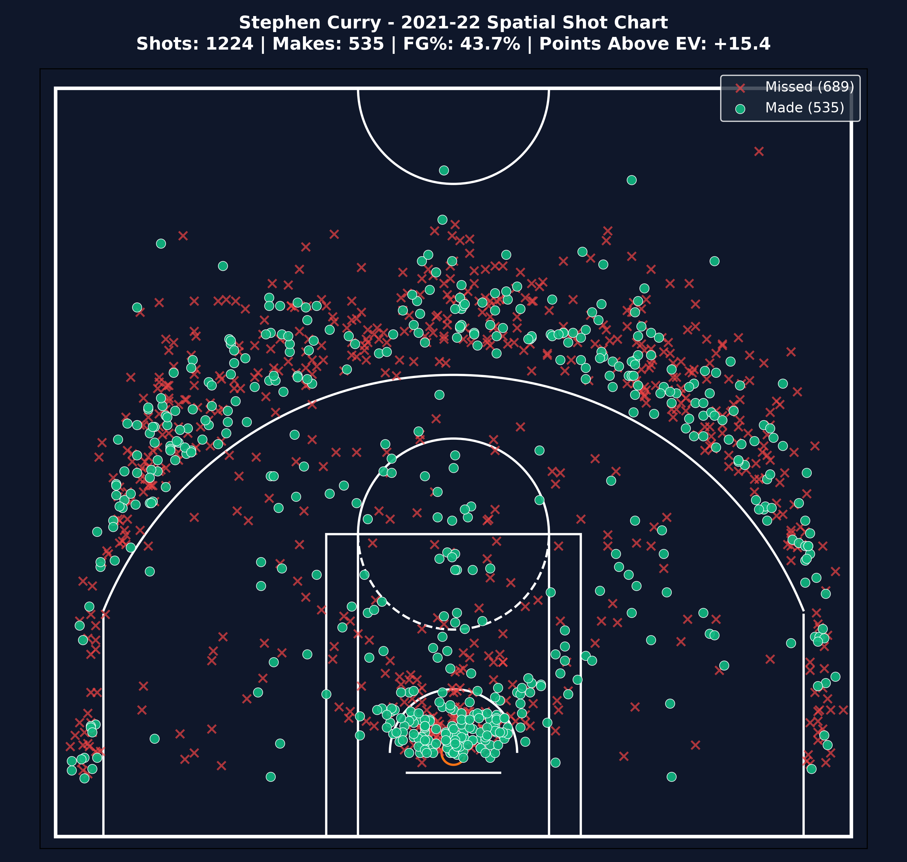
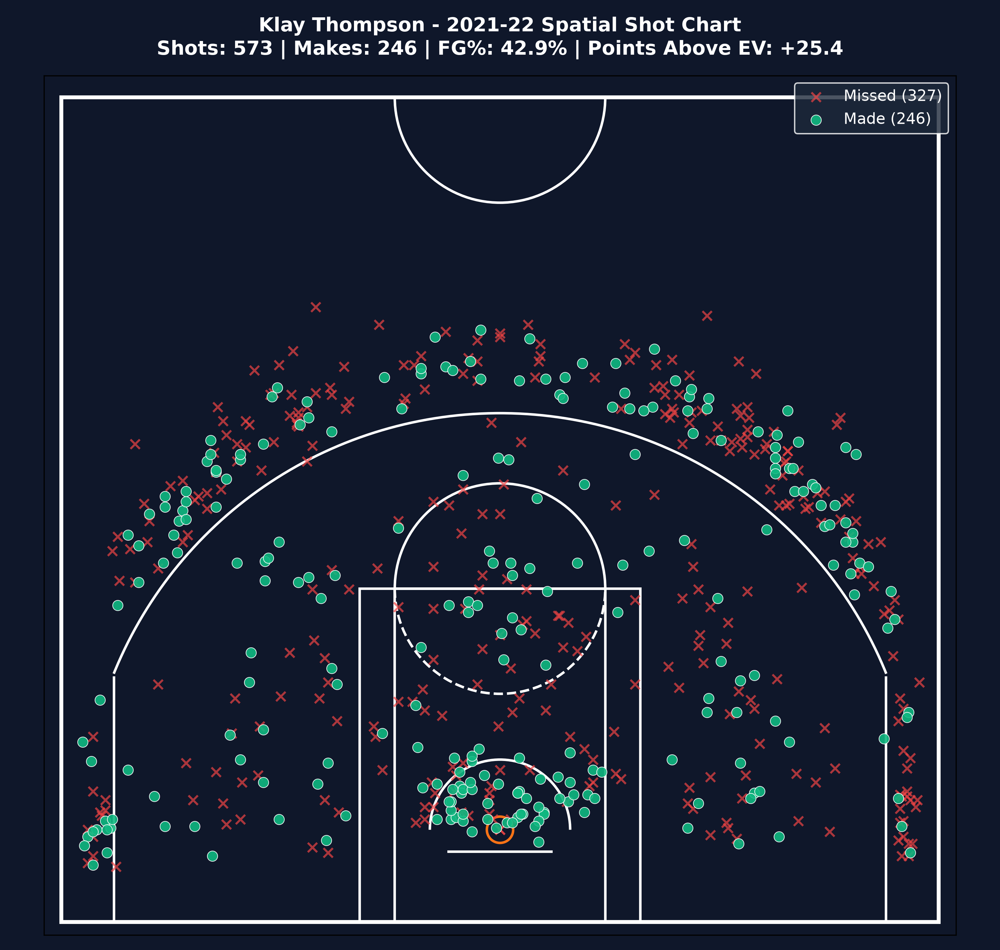
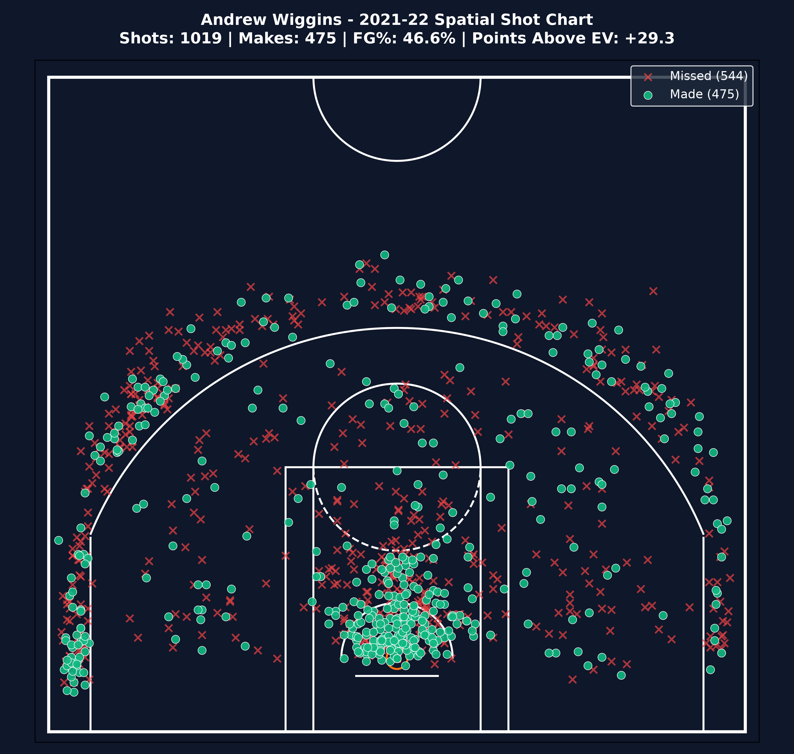

# NBA Spatial Efficiency & Expected Value Analytics

This project answers two questions: which Golden State Warriors players created the most value above their expected shot output, and how much of that performance was driven by shot location and zone efficiency during the 2021-22 season? It combines NBA shot logs, spatial zone baselines, and expected-value calculations into a reproducible data-science workflow.

## Key insight

The clearest result from the analysis is that Gary Payton II delivered the strongest efficiency on a per-shot basis, posting +53.99 total PAE with +0.1569 PAE per shot. Stephen Curry generated +15.41 PAE across 1,224 attempts, while Andrew Wiggins added +29.32 PAE on 1,019 attempts.

## Visual showcase

### Stephen Curry


### Player comparisons
| Player | Shot chart |
| --- | --- |
| Klay Thompson |  |
| Gary Payton II |  |
| Andrew Wiggins |  |

## Results table

| Player | Total shots | FG% | Total PAE | PAE per shot |
| --- | ---: | ---: | ---: | ---: |
| Gary Payton II | 344 | 0.6163 | 53.99 | 0.1569 |
| Andrew Wiggins | 1019 | 0.4661 | 29.32 | 0.0288 |
| Klay Thompson | 573 | 0.4293 | 25.36 | 0.0443 |
| Stephen Curry | 1224 | 0.4371 | 15.41 | 0.0126 |
| Otto Porter Jr. | 416 | 0.4639 | 15.19 | 0.0365 |

## Charts

- [images/stephen_curry_shot_chart.png](images/stephen_curry_shot_chart.png)
- [images/klay_thompson_shot_chart.png](images/klay_thompson_shot_chart.png)
- [images/gary_payton_ii_shot_chart.png](images/gary_payton_ii_shot_chart.png)
- [images/andrew_wiggins_shot_chart.png](images/andrew_wiggins_shot_chart.png)
- [images/nba_half_court.jpg](images/nba_half_court.jpg)

## Project structure

```text
NBA-Spatial-Efficiency-Analysis/
├── data/
│   ├── raw/
│   │   └── gsw_2022_roster_shots_root.csv
│   └── processed/
│       └── gsw_2022_processed_ev.csv
├── images/
│   ├── andrew_wiggins_shot_chart.png
│   ├── gary_payton_ii_shot_chart.png
│   ├── klay_thompson_shot_chart.png
│   ├── nba_half_court.jpg
│   └── stephen_curry_shot_chart.png
├── notebooks/
│   ├── 01_gsw_data_ingestion.ipynb
│   └── 02_gsw_feature_engineering.ipynb
├── reports/
│   ├── court_coordinate_mapping_guide.md
│   └── dax_measures.dax
├── src/
│   ├── __init__.py
│   ├── config.py
│   ├── court_visualizer.py
│   ├── ingestion.py
│   ├── pipeline.py
│   └── processing.py
├── .gitignore
├── LICENSE
├── README.md
├── RESUME_SHOWCASE.md
├── plot_player_shots.py
├── requirements.txt
└── .
```

## How to run

```bash
git clone <repo-url>
cd <repo>
pip install -r requirements.txt
jupyter notebook notebooks/01_gsw_data_ingestion.ipynb
```

To reproduce the feature engineering workflow:

```bash
jupyter notebook notebooks/02_gsw_feature_engineering.ipynb
```

## Data

- Source: NBA Stats API via `nba_api` and the team shot chart endpoint for the Golden State Warriors.
- Seasons covered: 2021-22 regular season.
- Collection method: roster and player shot requests were retrieved programmatically, cleaned into a single raw dataset, and saved in `data/raw/gsw_2022_roster_shots_root.csv` before feature engineering.
- Processed output: `data/processed/gsw_2022_processed_ev.csv`.

## Analytical framework

### Coordinate normalization

Raw NBA API coordinates are normalized from the standard NBA shot chart coordinate system into a 50ft x 47ft half-court layout used for spatial analysis and plotting.

### Expected Value

- Shot value = 3 for three-point attempts, 2 for two-point attempts.
- Zone baseline FG% = the historical make rate for each spatial court zone.
- Expected value = shot value × zone baseline FG%.
- PAE = actual points scored − expected value.

## Limitations

- Sample size is limited to the 2021-22 Golden State Warriors roster and season window.
- Data quality depends on API availability and the shot-chart record coverage returned by NBA endpoints.
- This project is descriptive, not causal: it identifies spatial efficiency patterns rather than proving causal drivers.
- No model claims are made beyond the observed relationship between shot location, expected value, and actual scoring output.

## License

This project is licensed under the MIT License. See [LICENSE](LICENSE) for details.

## Numbers changed for this README

This README uses only values already present in the project outputs and notebooks: 1,224 total attempts for Stephen Curry, 1,019 for Andrew Wiggins, 344 for Gary Payton II, +15.41 total PAE for Curry, +29.32 total PAE for Wiggins, and +53.99 total PAE with +0.1569 PAE per shot for Payton II.
