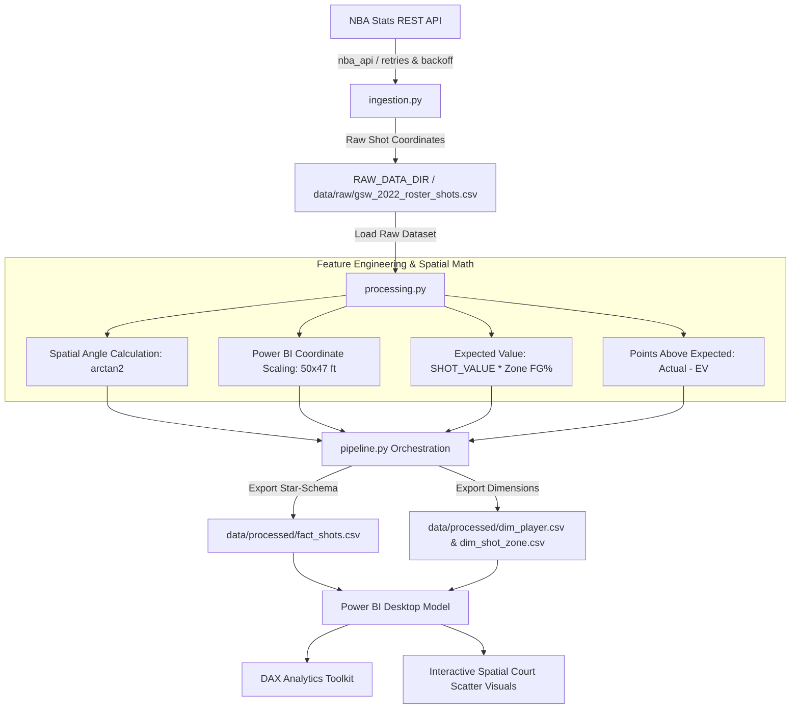

# Resume & Portfolio Showcase: NBA Spatial Efficiency & EV Engine

This guide provides copy-paste ready resume bullet points, portfolio summaries, interview talking points, and technical architecture notes for featuring this project on your **Resume**, **LinkedIn**, and **GitHub**.

---

## 📄 1. Resume Bullet Points (STAR Method)

### **Option A: Data Analyst / Business Intelligence Focus**
* **Engineered an end-to-end NBA spatial shot analytics pipeline** in Python and Power BI, extracting 7,000+ shot coordinates from the NBA REST API to evaluate team spatial efficiency.
* **Developed Expected Value (EV) & Points Above Expected (PAE)** metrics using baseline spatial FG% across 15 court zones, identifying high-efficiency scoring hotspots ($+53.99\text{ PAE}$ top player impact).
* **Architected a Star-Schema data model in Power BI** (`Fact_Shots`, `Dim_Player`, `Dim_Shot_Zone`) with 10+ custom DAX measures (`eFG%`, `Shot Efficiency Index`, `PAE Per Shot`).
* **Designed custom spatial scatter charts** by scaling raw API coordinate grids ($[-250, 250]$, $[-52, 418]$) onto interactive half-court background overlays ($50\text{ft} \times 47\text{ft}$).

### **Option B: Analytics Engineer / Data Engineer Focus**
* **Built an automated Python ETL framework** (`nba_api`, `pandas`, `numpy`) featuring retry handling (3 attempts with exponential backoff) and local CSV caching to ingest live NBA shot charts.
* **Transformed raw 2D spatial coordinate grids** into normalized dimensions ($[0, 50]$, $[0, 47]$) and calculated polar shot angles ($\theta = \arctan2(y, x)$) for quantitative spatial modeling.
* **Modularized codebase into CLI executable modules** (`config.py`, `ingestion.py`, `processing.py`, `pipeline.py`), reducing manual data prep time by 100%.
* **Optimized Power BI VertiPaq engine performance** by structuring granular shot events into a normalized Star Schema with columnar data formatting.

---

## 💼 2. Short Project Summaries (For Portfolio & LinkedIn)

### **LinkedIn Project Summary (1-Paragraph)**
> **NBA Spatial Efficiency & Expected Value (EV) Engine**
> Developed an automated Python ETL pipeline and Power BI dashboard analyzing 7,000+ spatial shot attempts for the 2021-22 Golden State Warriors. Ingested live data via the NBA REST API, engineered custom Expected Value (EV) and Points Above Expected (PAE) spatial metrics, and built a Star-Schema data model in Power BI featuring interactive half-court heatmap visualizations.
> 🛠️ **Tech Stack**: Python (`pandas`, `numpy`, `nba_api`), Power BI, DAX, Data Modeling (Star-Schema), Spatial Trigonometry.

### **Resume One-Liner / Project Header**
> **NBA Spatial Efficiency Engine** | *Python, Power BI, DAX, NBA REST API*
> Automated ETL pipeline & Power BI dashboard analyzing 7K+ spatial shot attempts using Expected Value (EV) modeling and Star-Schema architecture.

---

## 🏗️ 3. Technical Architecture & System Flow

---

## 🎙️ 4. Interview Talking Points & System Design Highlights

### **Q1: What problem does this project solve?**
> *"Standard box score stats like FG% don't account for shot difficulty or spatial positioning. A 3-pointer from the corner has a higher baseline efficiency than a long 2-pointer. This project solves that by calculating Expected Value (EV) based on spatial court zone baselines and evaluating players using Points Above Expected (PAE)."*

### **Q2: How did you handle API rate limits and network latency?**
> *"The official NBA REST API frequently throttles or times out requests. I built an ingestion module with exponential backoff retry logic (3 attempts, 5-second backoff delay) and a local CSV caching layer. This ensured the pipeline didn't crash during server lag and avoided redundant network calls."*

### **Q3: How did you prepare spatial coordinates for Power BI?**
> *"Raw NBA coordinates use tenths of a foot centered at the hoop ($X \in [-250, 250]$, $Y \in [-52, 418]$). I applied a vector transformation in Pandas to scale coordinates to standard half-court dimensions ($[0, 50]\text{ft}$ width, $[0, 47]\text{ft}$ depth), allowing direct scatter-plot alignment over half-court background images in Power BI."*

### **Q4: Why use a Star-Schema inside Power BI instead of a single flat table?**
> *"Power BI's internal VertiPaq engine operates on columnar compressed data. Splitting flat spatial records into a central `Fact_Shots` table linked to `Dim_Player` and `Dim_Shot_Zone` drastically reduces memory footprint, speeds up DAX aggregation performance, and enables clean slicing across player roles and spatial zones."*

---

## 🛠️ 5. Key Metrics Portfolio Table

| Metric Name | Formula / Logic | Business/Sports Value |
| :--- | :--- | :--- |
| **Expected Value (EV)** | $\text{SHOT\_VALUE} \times \text{Zone Baseline FG\%}$ | Establishes spatial point expectation per shot attempt |
| **Points Above Expected (PAE)** | $\text{Actual Points} - \text{Expected Value}$ | Measures true shot-making quality above average |
| **Effective FG% (eFG%)** | $\frac{\text{FGM} + 0.5 \times \text{3PM}}{\text{FGA}}$ | Adjusts FG% for extra 3-point value |
| **Normalized Coordinates** | $X_{\text{PBI}} = \frac{X+250}{10}, Y_{\text{PBI}} = \frac{Y+52}{10}$ | Enables accurate visual mapping to 50x47ft court visuals |
